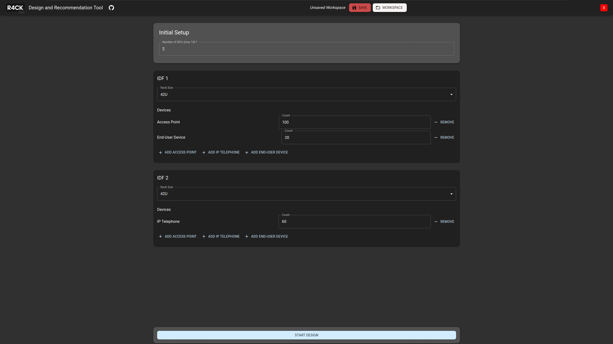
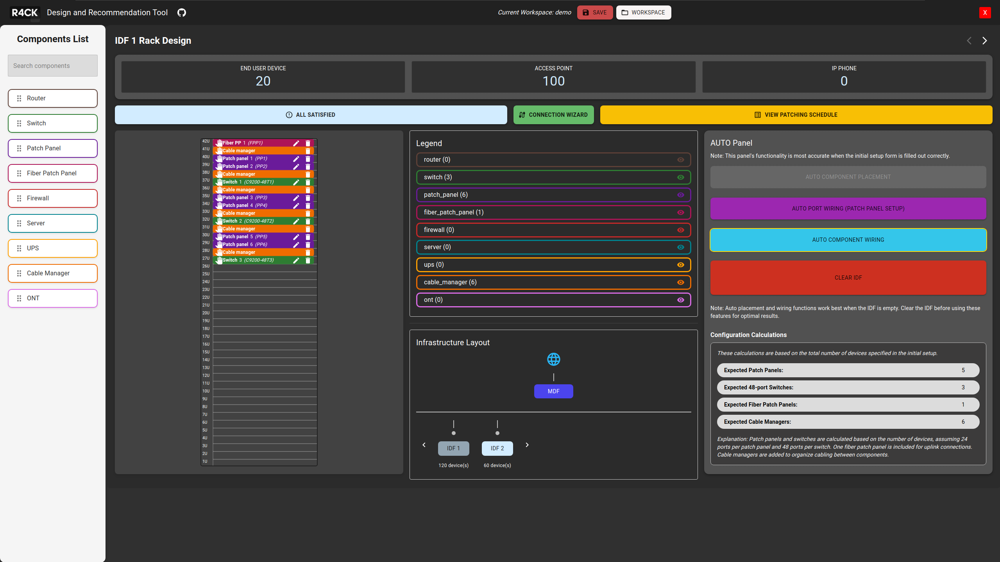
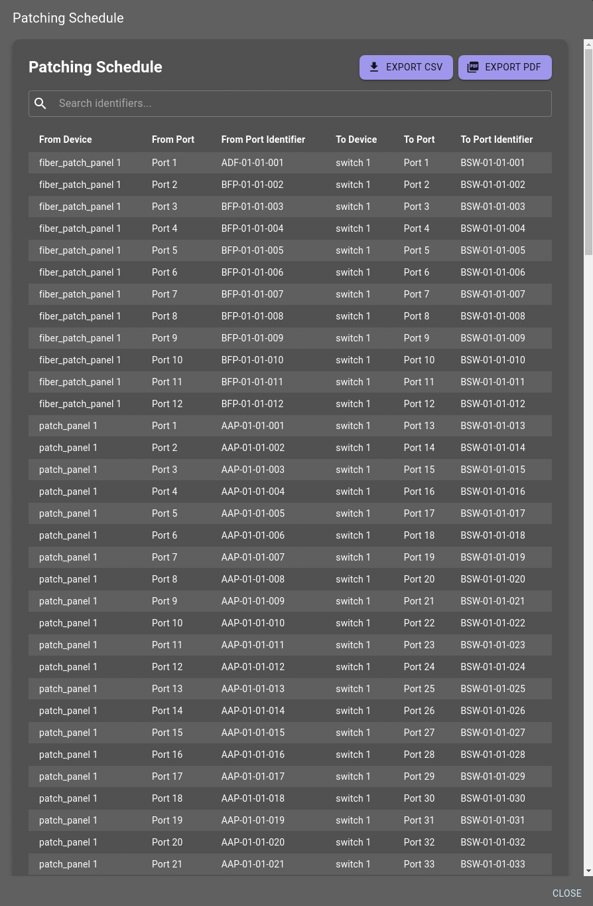

# R4CK - Network Rack Visualization Tool

This application provides a visual representation of distribution frames racks, allowing users to configure and manage network components efficiently and connect them together correctly.

## Features

- Interactive rack visualization for multiple IDFs and MDF
- Drag-and-drop component placement and configuration
- Auto-placement of components based on initial setup
- Auto-wiring of components for efficient connectivity
- Auto port wiring for patch panel setup
- Patching schedule management and visualization
- Issues tracking and resolution with detailed recommendations
- Connection Wizard for guided connectivity setup
- Inter-IDF connection management and visualization
- Component highlighting for easy identification
- Save and load rack designs for persistence

## Todo
Improve the autocomponent & autowiring MDF template by doing the following: 
1) Connect the ONT component to a Router component
2) Connect the Router component to a Firewall component
3) Connect the Firewall component to the core Switch component
4) (* Maybe) For more security a Firewall would be placed between the ONT and Router components

## Images

Below are some images for the application

### Initial setup screen where users can configure their Intermediate Distribution Frames (IDFs), specifying device types and quantities for accurate rack design

### Showcasing the layout of the rack and its components, with options for auto wiring and component placement, as well as a detailed infrastructure layout.

### Detailed patching schedule displayed in a tabular format, allowing users to export data in CSV or PDF format
